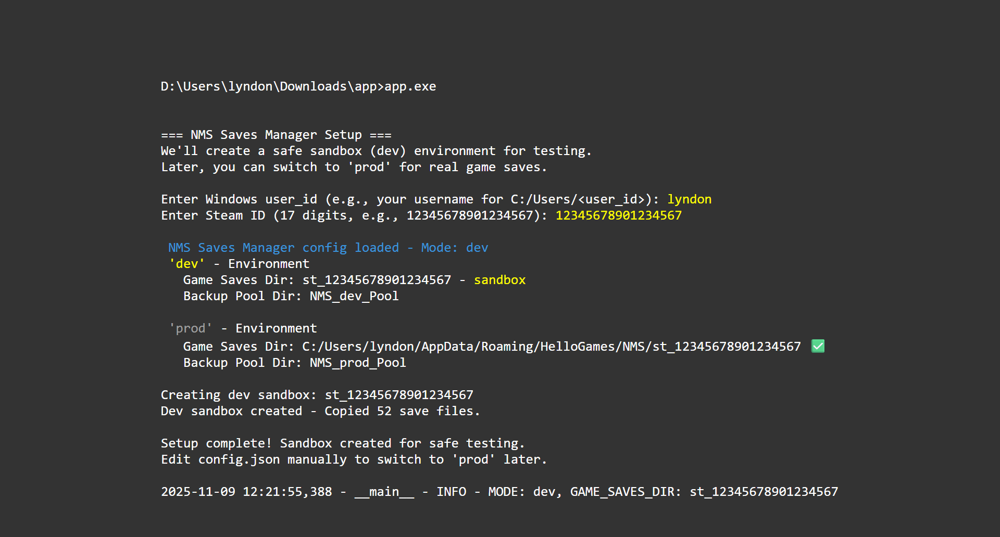

# NMS Saves Manager

**Historical Note**

I have used robocopy to backup my NMS saves for years. Every time you use robocopy it backs up games that haven't change and the cache. My cache is now 438 MB, the savexx.hg files are 39 MB and I have 24 backups totaling 10.7 GB. I have deleted many that I wish I still had. The Pool I have created with NMS Saves Manager is 248 MB and 96 games with unique mtimes (modified date-time). NMS currently only allows 15 save game slots. There are more Expeditions than that plus Reduxs.

**Quick Start Guide**

Download zip, extract and rename directory to app then run app.exe  
enter <user_id> and <steam_id>  
Steam > Settings > Account > Account Details > Steam ID: (17 digits)  

Navigate to http://localhost:5000

Click 'Backup Saves'

You are now in the Sandbox. You have to edit config.json and  
change "mode": "dev" to "mode": "prod" to manage **"live"** Saves  
Hit Ctrl+C in console to exit app.exe  

Game Saves must be in **C:\User\\<user_id>\HelloGames\NMS\st_\<stean_id>** for this app to work. 

**Final Notes:**

It is highly recommended that when you start a new game you immediately go to Options and Rename Save. You have to create a Restore Point for it to stick. It is also highly recommended that you give it a unique name from all the other Game Saves you have. I suggest not putting the S\<slot number> in their like I did before I wrote this app. My philosophy now is to save slots 14 and 15 as your scratch pad for moving backup too. Later I want to add a search by Save Name that lists all the slots you have backups in. Unfortunately you can't rename a backup without changing its 'mtime' and I don't want to touch the save file.
