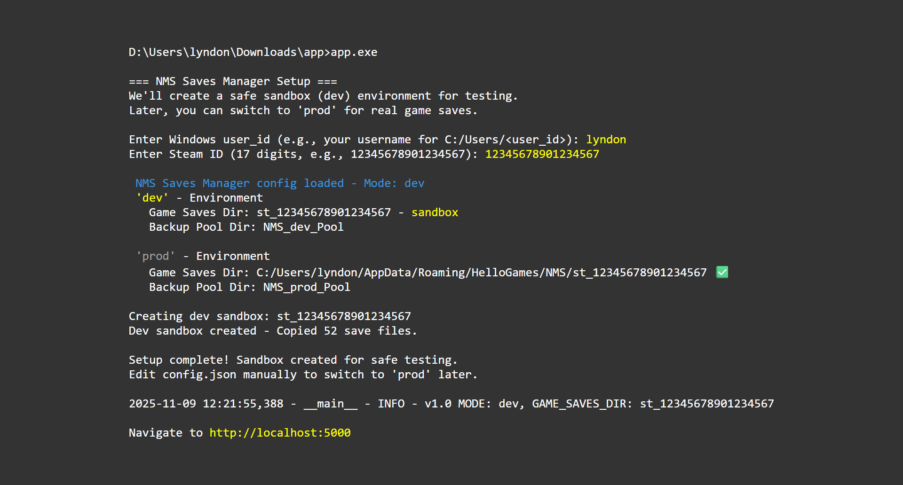
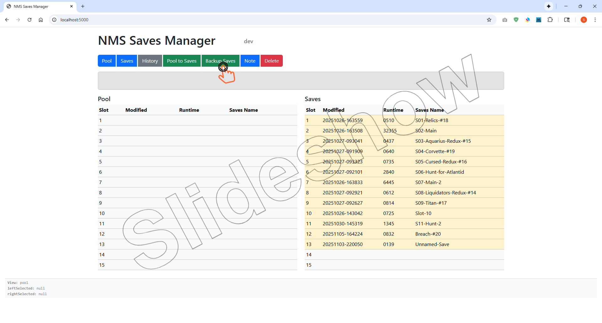
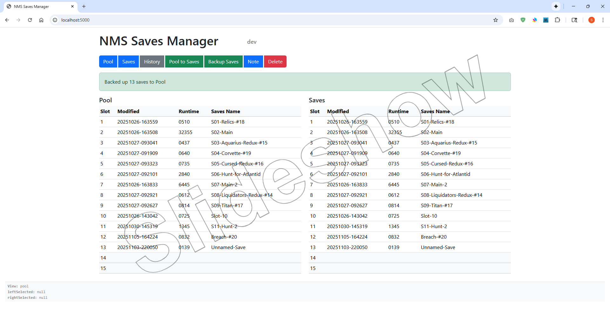

# NMS Saves Manager

⚠️ **WARNING** If you have Steam Cloud turn on then delete the saves games in the game or steam cloud brings them back automatically. 

**Historical Note**

I have used robocopy to backup my NMS game saves for years. Every time you use robocopy it backs up all the games that haven't change and the cache. My cache is now 438 MB, the savexx.hg files are 39 MB and I have 24 backups totaling 10.7 GB. I have deleted many that I wish I still had. The Pool I have created with NMS Saves Manager is 248 MB (2%) and 96 games with unique mtimes (modified date-time). NMS currently only allows 15 game saves slots. There are more Expeditions than that plus Reduxs.

**Quick Start Guide**

Download ZIP, extract and rename directory to 'app' then run app.exe  
enter <user_id> and <steam_id>  
Steam > Settings > Account > Account Details > Steam ID: (17 digits)  

Navigate to http://localhost:5000

Click 'Backup Saves'

You are now in the Sandbox. You have to edit config.json and  
change "mode": "dev" to "mode": "prod" to manage **"live"** Saves  
Hit Ctrl+C in console to exit app.exe  

Game Saves must be in **C:\Users\\<user_id>\HelloGames\NMS\st_\<stean_id>** for this app to work. 

**Final Comment:**

It is highly recommended that when you start a new game you immediately go to Options and Rename Save. You have to create a Restore Point for it to stick. It is also highly recommended that you give it a **unique** name from all the other Game Saves you have. I suggest not putting the S\<slot number> in their like I did before I wrote this app. If you don't give it a Save Name it will be "Unnamed-Save" in the manager and you won't be able to change it later without creating another backup. Rename your Game Saves now before creating your first backup. My philosophy now is to save slots 14 and 15 as your scratch pad for moving backups too. Later I want to add a search by Save Name that lists all the backups you have by that Save Name. Unfortunately you can't rename a backup without changing its 'mtime' and I don't want to touch the save files.

This was a collaborative effort with [Grok 4 Fast](https://x.com/i/grok)
